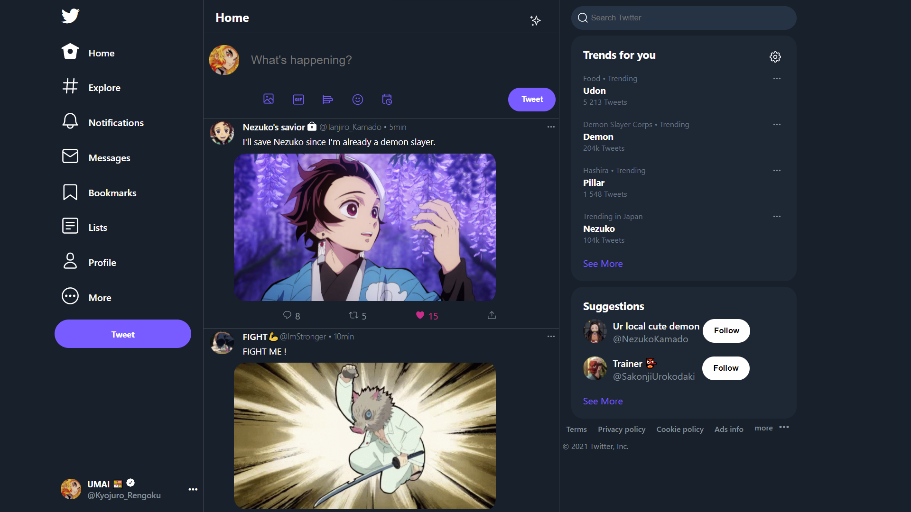

"# Twitter_copy_HTML_CSS_project" 

# Twitter_copy_HTML_CSS_project



## Summary

- **Genesis :** School Project
- **Technology**
- **Global Structure**
- **Responsive**
- **JavaScript**
- **What did we learn ?**

### Genesis : School project

As part of a school project, we had to recreate the Twitter home page.

This project consisted in recreating the page using HTML5 and CSS3. I allowed myself to add elements in JavaScript.

Enjoy seeking the code !

### Technology

For this project, we had to use various tools. Here are those I personnaly used for my website:
#### HTML5

Our HTML file is a fundamental here because it's like the body of our project. It allows us to define a skeleton for our website, to declare the numerous elements inside of it.  

#### CSS3

In the assets folder you can see our stylesheet `styles.css`. It is really useful because it allows us to style every single element that we declared earlier. If the html file is our skeleton, this stylesheet is its skin.

#### Font Awesome

Now, this skin must be enriched with some original visuals such as beautiful icons, and Font Awesome is really great at this job because it delivers almost endless possibilities for our icons, even more if you own the pro version. (but for this project this is not my case) 

#### JavaScript

Javascript is really helpful at making our elements more dynamic, it's an awesome tool to use for our website because a body is nothing if it's only flesh and bones ! If we want to compare our webpage to the human body once more, let's say that it ensure the role of muscles and nervous system. The true complexity of this website comes with javascript: without it, your page is nothing else than pure visuals. In other words, smoke and mirrors!   


### Global Structure : Designing our website

Flex
I decided to use the property display:flex for my body in order to easily divide my website into three horizontal parts:
    - container (the navigation, to the left)
    - feed (in the middle with the tweets)
    - right (to the right with the suggests)

Now, only the main and left the part must be scrolled. According to this, I decided for the right part to create a child section taking 100% of the height and width of the column, and to make it fixed by using `position:fixed` property so it can't be scrolled anymore. 
Then I decide for the main and the left part to use the `overflow-y: scroll`, so I can scroll each part independently.

### Responsive

I decided to cut the responsive in 4 parts :
1. Wider than **1280px** : Everything is visible and the aside part is responsive.
2. Thinner than **1280px** : Hide the text from the navigation part.
3. Thinner than **1100px** : Hide the aside part, and make the feed side fit the screen.

### JavaScript

As said before, I allowed myself to add 2 elements in JavaScript.
The first one is a div that appear only when the user click on the button `<more>`, and then dispear when the user click somewhere on the screen. The second one is the same exepct that the user click on the profile button.


```html
<script>
    // I get the DIV element by his tag name.
    const subItemsBox = document.querySelector('.sub-items-box');
    // Then I get the more button by his tag name.
    const moreBtn = document.querySelector('#moreBtn');
    // And I get the overlay.
    const overlay = document.querySelector('.overlay');
        
    // I add an event listener. When the user click on the profil button, the sub menu is active, so it appear.
    moreBtn.addEventListener('click', function() {
        subItemsBox.classList.add('active');
        overlay.classList.add('active');
    });

    // I add an event listener. When the user click on the profil button or anywhere else on the screen, the sub menu is no more active, so it disappear.
    overlay.addEventListener('click', function() {
        subItemsBox.classList.remove('active');
        overlay.classList.remove('active');
    })
</script>
```

### What did we learn ?

This project gave me the opportunity to consolidate my knowledge in HTML, and develop my skills in CSS and more particularly responsive.

I was also able to try Javascript, which really gave my project a nice addition.

A true thanks for reading our ReadMe.md

### Credits

[LouisRvlE](https://github.com/LouisRvlE) : Louis Réville
[Kimiruu](https://github.com/Kimiruu) : Kiara Drouin
[K4mlna](https://github.com/K4mlna) : Tawan-François Asselain